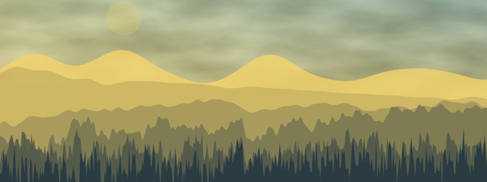
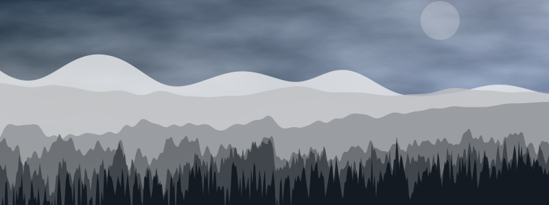
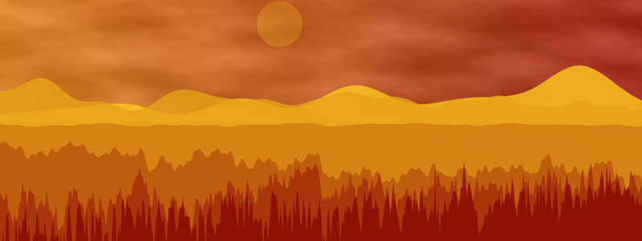

# NoisyLandscapes.jl
[](http://htmlpreview.github.io/?https://raw.githubusercontent.com/mossr/NoisyLandscapes.jl/master/images/landscape-notebook.html)

Generate landscapes using Simplex noise in Julia.

- **All credit goes to [Cormullion](https://github.com/cormullion)**
    - [Original source](https://github.com/cormullion/cormullion.github.io/blob/dev/source/noise.jl)
    - [Blog post](https://cormullion.github.io/pages/2018-10-11-noise/)

## Installation
```julia
using Pkg
pkg"add https://github.com/mossr/NoisyLandscapes.jl"
```

## Generating landscapes

```julia
using NoisyLandscape

landscape(ColorSchemes.starrynight, "landscape-starrynight")
```

<p align="center">
</img>
</p>


```julia
landscape(ColorSchemes.oslo, "landscape-oslo")
```

<p align="center">
</img>
</p>

```julia
landscape(ColorSchemes.sun, "landscape-sun")
```

<p align="center">
</img>
</p>

## Notebook

See the [landscape-notebook.jl](./src/landscape-notebook.jl) to play around with PlutoUI selectors for different colorschemes.

- [Static HTML notebook](http://htmlpreview.github.io/?https://raw.githubusercontent.com/mossr/NoisyLandscapes.jl/master/images/landscape-notebook.html)
